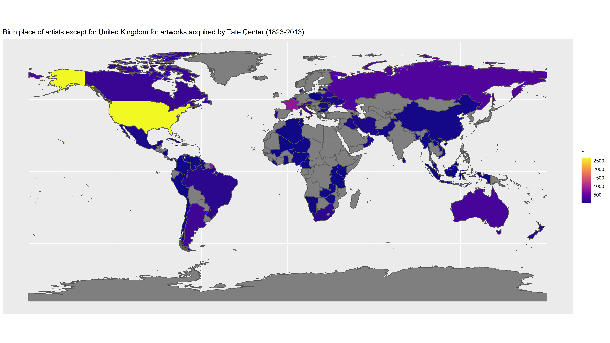
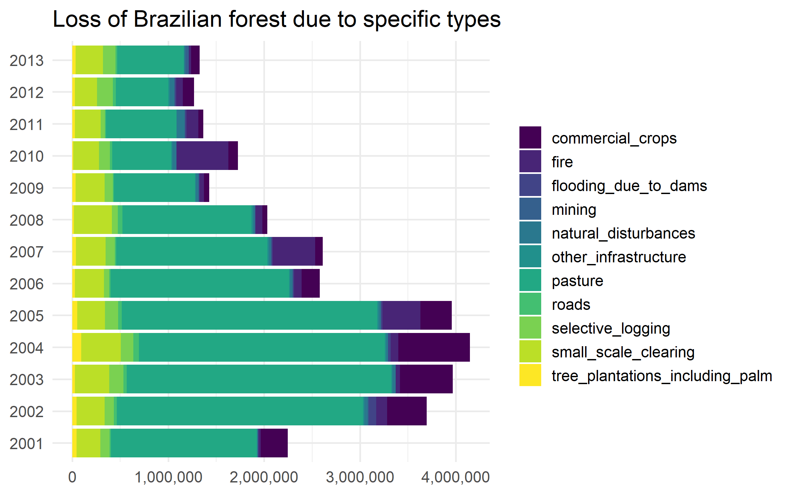

Here are my some of visualizations of the [TidyTuesday](https://github.com/rfordatascience/tidytuesday) challenge in 2021. You can find more on my [github](https://github.com/Kim-s-h/tidytuesday).

# Analysis of my netflix viewing history 

# Birthplace of artists for artworks acquired by Tate Center

# Loss of Brazilian forest

